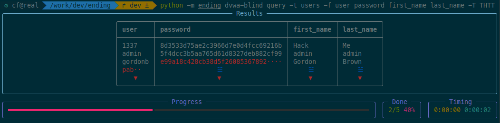
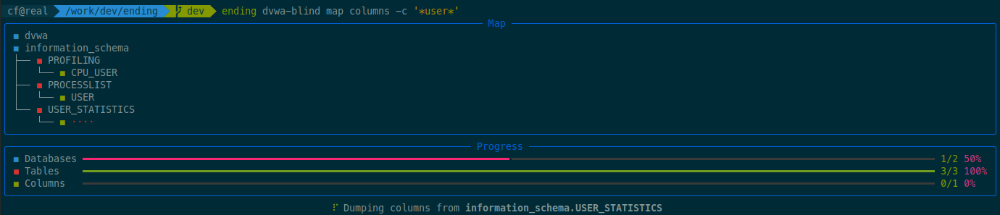

# What is ending?

**ending** is a flexible SQL injection framework and CLI that works just as well for simple injections as it does for **very complex ones**.

Like sqlmap, it can be used out of the box for common SQL injection scenarios. However, **ending** is designed so that when the target stops being simple, you don’t need to abandon the tool and write custom scripts — you write python code instead.

Documentation and tutorials are available [here](https://cfreal.github.io/ending/).

# Installation

```shell
$ pip install cfreal-ending
```

# Documentation

Documentation is available at [cfreal.github.io/ending](https://cfreal.github.io/ending).

# A different approach to SQL injection

Most tools work fine for straightforward SQL injections over HTTP. However, when dealing with a complex case, a WAF, or other limitations, you often end up writing a custom script to inject your payloads. This is why **ending** was built.

## Python-based target definitions

In **ending**, targets are defined using Python design files.

Instead of only configuring a URL and parameters through CLI arguments, you write a small Python method that sends an SQL payload to the target.

This function can be as simple as a single HTTP request — or as complex as needed.

Because it’s Python, you can naturally handle:

- authentication and sessions
- custom headers and encodings
- non-HTTP protocols
- WAF bypass logic
- complex request flows

For simple targets, this is often only a few lines of code. For complex targets, it removes the need to switch tools entirely.

## AST-based SQL generation 

**ending** operates on the SQL Abstract Syntax Tree (AST) level, rather than building payloads as raw strings.

- Injection techniques (UNION, error-based, blind, time-based, etc.) are implemented in a generic and reusable way
- Each DBMS translates the AST into its own SQL dialect

Most of the time, you don't need to get that deep into the tool, as *ending* does everything itself. But if you face a complex injection, you can change the way AST nodes are converted into SQL syntax, and thus build advanced bypasses, such as:

- To get rid of badchars (for instance, `a<b` can be written as `a BETWEEN 0 AND b`)
- To make function calls less easy to spot for the WAF: `SUBSTR(a, b)` becomes `SUBSTR# comment\n(a,b)`

And it only takes a few lines of code!

# Screenshots

A few screenshots of the tool's output.


*Dumping some fields from a `users` table*


*Dumping columns whose name contains `user`*
