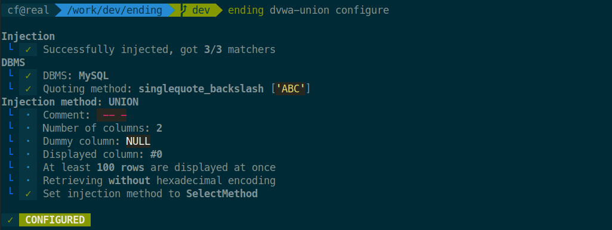
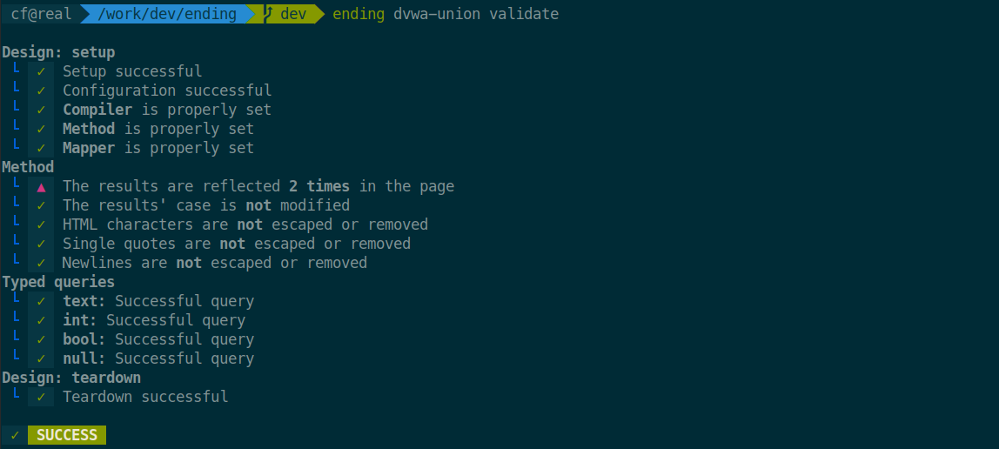

# Configuring a design

Say you found an SQL injection during a pentest. To exploit it using **ending**, you need to create a *design*, which is a python class that defines your injection. You then test it, run queries, and dump the database schema.

## Creating a design (`create`, `edit`)

Pick a name, say `my-design`, and use `create` to create a new design:

```bash
$ ending my-design create
```

To edit it, use `edit`.

```bash
$ ending my-design edit
```

It'll open your design file with your file editor.

!!! note

    Ending is heavily documented and typed. Make sure the `ending` library is in the python path to get autocompletion and typing information from your IDE, which greatly helps for development.

!!! note

    By default, `ending` creates an [HTTPDesign](../pdoc/ending/cli/design.html#ending.cli.design.HTTPDesign), which is suited for SQL injections over HTTP. If you need to use another protocol, just change the base class to [Design](../pdoc/ending/cli/design.html#ending.cli.design.Design).

The created design contains a single method, `send()`.

## Importing a design from an HTTP request (`import`)

If you already have the HTTP request you want to inject, you can use `import` to create a design pre-filled with the corresponding `send()` method. Just pipe the raw request in:

```bash
$ ending my-design import < my-request.txt
```

You can also paste a bare URL:

```bash
$ ending my-design import < <(echo 'https://target.com/page?id=4')
```

Or run `import` without redirection: **ending** will prompt you to paste the request, then press **Ctrl-D** to confirm.

Either way, the design file is opened in your editor right after, ready to add the injection point.

!!! note

    Query parameters, headers, cookies, and the request body (JSON, form-encoded, or multipart) are all handled automatically.

!!! note

    If the design already exists, use `--force` (or `-f`) to overwrite it.

The generated `send()` method reproduces the request exactly as captured — you only need to splice in `payload` where the injection should go.

## The `send()` method

The first step in setting up our design is to edit the `Design.send()` method. This method is called to send the payload to the server and return the response.

For web SQL injections, this generally consists in sending an HTTP request to the vulnerable page, and returning the response.

```python
class Design(HTTPDesign):
    async def send(self, payload: str) -> bytes:
        response = await self.session.post(
            'http://target.com/api/news',
            params={
                "id": payload
            }
        )
        return response.content
```

That's it!

!!! note

    The `Session` has exactly the same API than [the one from the `requests` library](https://pypi.org/project/requests/). The only difference is that its `get()` and `post()` methods are asynchronous, and require the use of the `await` keyword.

## Automatic configuration (`configure`)

If the injection is simple enough, **ending** can setup the injection itself. Go back to the CLI and run:

```bash
$ ending my-design configure
```

If everything goes well, **ending** will automatically configure the design for you. Otherwise, you might have to adjust your `send()` method, or configure the design manually. Check [here to see how it is done](manual.md).

Here's an example of a successful configuration:



Check your design file: it now contains additional methods, such as `set_method()` and `inject()`. You can now validate the design.

## Testing a design (`validate`)

Once ready, validate that the design behaves properly using `validate`. After checking the looks of your design, it will issue several test queries to ensure everything works properly, and make suggestions as to why it does not.



If it works, you're good to go. Otherwise, a human-readable error will be displayed if possible, or you'll get a stacktrace to debug the whole thing.

When the validation is successful, you can use the design to run queries or dump the database schema.

## Using the design

You're now ready to use the design to [run arbitrary SQL queries](query.md) or [dump the database schema](map.md).

## Advanced configuration

### Proxy

A proxy can be set using the `HTTP(S)_PROXY` environment variables, when running the script:

```bash
$ HTTPS_PROXY=http://localhost:8080 ending my-design query -f 'user()' 'version()'
```

Otherwise, the `HTTPDesign` class can bear a `PROXY` argument that sets a proxy for the requests.

```python
class Design(HTTPDesign):
    PROXY = "http://localhost:8080"

    ...
```

### Number of concurrent connections

In addition, one can set the maximum number of concurrent requests with `WORKERS` (defaults to *2*):

```python
class Design(HTTPDesign):
    WORKERS = 4

    ...
```