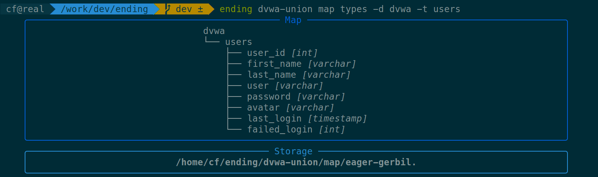
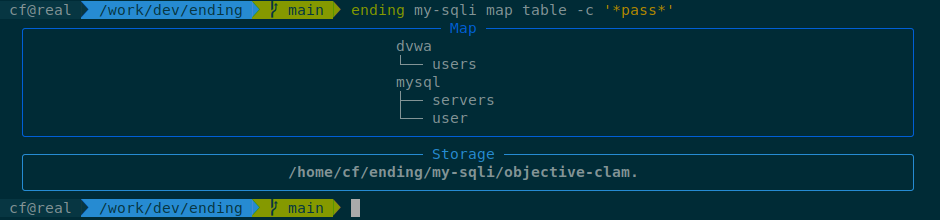

# Dumping database schema (`map`)

Use `map` to dump the database schema, *i.e.* the name of the **databases**, **tables**, **columns**, and their **types**.

Results can be filtered by database, table, and column names. The filters allow wildcards, such as `*` (match 0 characters or more) and `?` (match one character).

The dumped schema gets stored in your design's directory, as plaintext (*.txt*) and CSV (*.csv*). Use `--output` to indicate a different storage prefix.

## Examples

### Dumping databases

```bash
$ ending dvwa-union map databases
```

### Dumping columns and types of a specific table

Dump all columns of the `dvwa.users` table, and their types:

```bash
$ ending dvwa-union map types -d dvwa -t users
```



### Dumping tables with a column filter

This query dumps all tables that contain a column whose name contains `pass`, like `user_password`, `password`, `pass`, *etc.*

