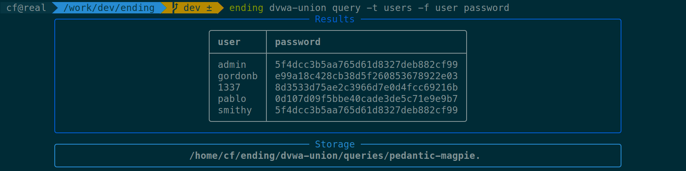
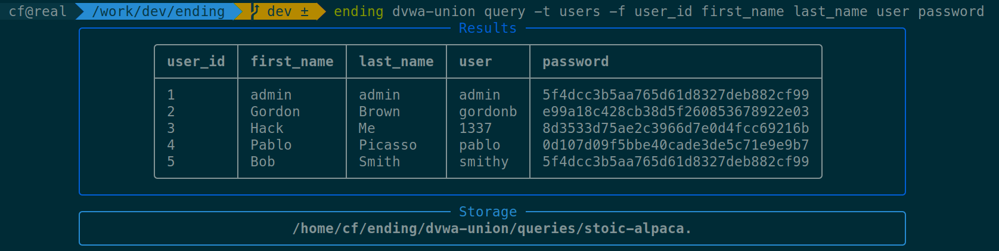

# Running queries (`query`)

Once your design is configured, you can run arbitrary SELECT queries using `query`. It supports table (`FROM`), fields (`SELECT`), conditions (`WHERE`), ordering (`ORDER`), and bounds (`LIMIT`).

Results get **stored** in your design's directory, as plaintext (*.txt*) and CSV (*.csv*). Use `--output` to indicate a different storage prefix.

## Examples

### Running a simple query (`FROM`, `SELECT`)

Fetch columns `username`, `password` of table `users`:



Fetch columns `user_id` `first_name` `last_name` `user` and `password` of table `users`:



### Using conditions (`WHERE`)

Dump users with an ID inferior to 3:

```bash
$ ending dvwa-union query -t users -f user password -w 'user_id<3'
```

Dump the user with username `pablo`:

```bash
$ ending dvwa-union query -t users -f user password -w 'user={}' 'pablo'
```

!!! note

    The `{}` notation format additional arguments into the string with the quoting function of the compiler. For instance, if quoting is set to hexadecimal, it'd be translated in `user=0x7061626c6f`.

### Dumping specific rows (`LIMIT`)

Dump 2 rows starting from offset 3:

```bash
$ ending dvwa-union query -t users -f user password -s 3 -c 2
```

## Arguments table

Following is a table of the arguments that can be used with `query`. For more information, use `ending <your-design> query --help`.

| Argument | Description | SQL keyword | Example |
|----------|-------------|-------------|---------|
| `--table` (`-t`) | Table name | `FROM` | `-t users` |
| `--fields` (`-f`) | Fields | `SELECT` | `-f username password` |
| `--where` (`-w`) | Condition | `WHERE` | `-w user={} pablo` |
| `--order` (`-o`) | Ordering | `ORDER BY` | `-o username` |
| `--start` (`-s`) | Index of first row | `LIMIT` (start) | `-s 3` |
| `--count` (`-c`) | Number of rows to dump | `LIMIT` (count) | `-c 3` |


## Typing

Due to its architecture, **ending** has great support for typing. You can specify the type of the columns you're dumping using `--field-types` (`-T`):

- `T`: Text-based type (`VARCHAR`, `TEXT`)
- `I`: Integer type (`INT`, `INTEGER`)
- `B`: Boolean type (`BOOL`, `BOOLEAN`) 
- `X`: Binary type (`BLOB`, `BYTEA`)
- `H`: Hexadecimal text
- `6`: Base64 (and Base64URL)
- `U`: Unknown (default)

```bash
$ # Dumping columns id, username, password, active, and role as
$ # integer, text, hexadecimal, boolean, and integer respectively
$ ending my-sqli query -f users -t id username password active role --field-types ithbi
```

!!! notes

    If you want greater control over the type of the columns, use **ending** as a library: you can set the length of a field, the expected charset, etc.